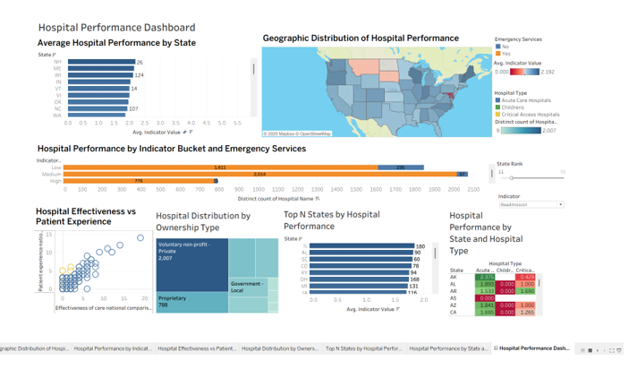
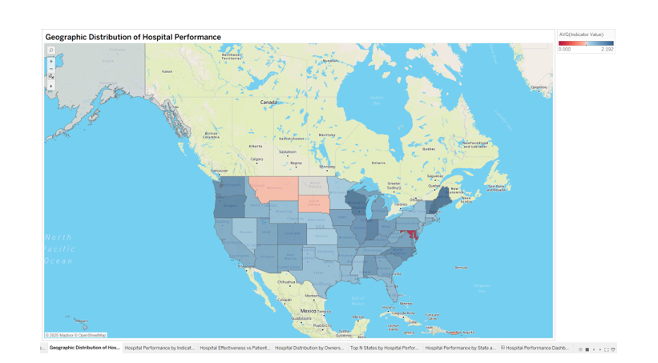
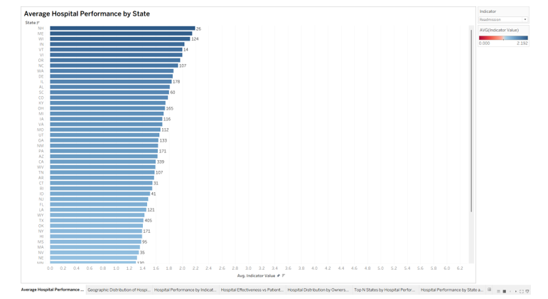
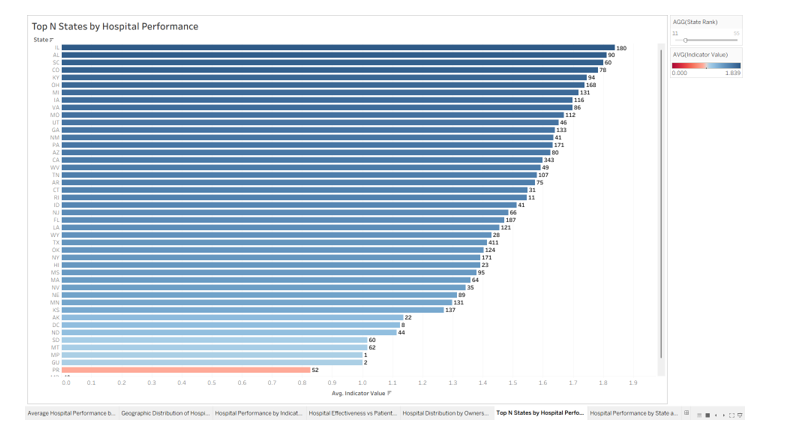
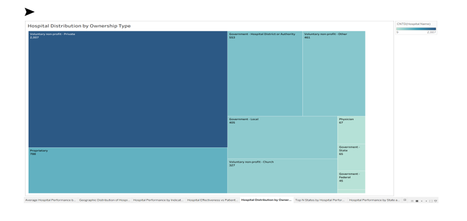
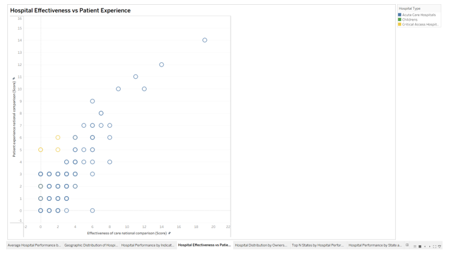
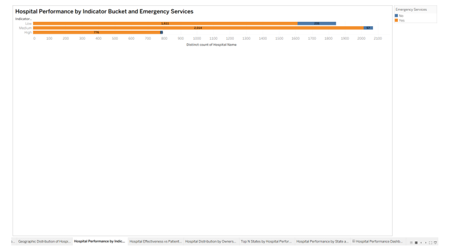

# 🏥 Hospital Performance Dashboard | Tableau

## 📌 Project Overview

This project presents an interactive Tableau dashboard designed to evaluate hospital quality, patient safety, and healthcare performance across multiple states. The dashboard combines advanced data visualization techniques with interactive analytics to help decision-makers monitor hospital performance and identify opportunities for quality improvement.

---

## 🎯 Business Problem

Healthcare organizations need accurate and interactive dashboards to monitor hospital performance, compare quality metrics, and support evidence-based decision making.

This dashboard enables healthcare stakeholders to:

- Monitor hospital quality across states
- Compare ownership types and performance
- Evaluate patient safety metrics
- Forecast future readmission costs
- Identify high-performing and low-performing hospitals

---

## 🛠️ Tools & Technologies

- Tableau
- Calculated Fields
- Level of Detail (LOD) Expressions
- Parameters
- Forecasting
- Dashboard Actions
- Data Blending
- Healthcare Analytics

---

## 📊 Dashboard Features

- Hospital Performance Dashboard
- Geographic Analysis
- Hospital Quality Monitoring
- Patient Safety Analysis
- KPI Dashboard
- Forecasting
- Interactive Filters
- Executive Dashboard

---

## 📈 Key Insights

- Compared hospital quality across different states.
- Identified performance differences by ownership type.
- Forecasted hospital readmission costs.
- Applied LOD calculations for state-level benchmarking.
- Created interactive dashboards using parameters and dashboard actions.

---

## 📂 Repository Contents

- Tableau Workbook (.twbx)
- Project Documentation
- README
- Dashboard Screenshots

---

## 🚀 Future Improvements

- Real-time hospital monitoring
- Predictive healthcare analytics
- SQL database integration
- Tableau Server deployment

---

# 📸 Dashboard Preview

## 🏥 Final Dashboard

---

## 🗺️ Geographic Distribution of Hospital Performance

---

## 📊 Average Hospital Performance by State

---

## 🏆 Top N States by Hospital Performance

---

## 🌳 Hospital Distribution by Ownership Type

---

## 📈 Hospital Effectiveness vs Patient Experience

---

## 📉 Hospital Performance by Indicator Bucket & Emergency Services

